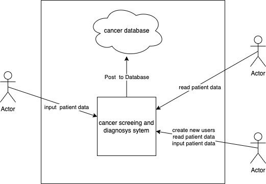

# Cancer Burden Research Project
# Objective 4

---

# Objective 4
## Problem statement

The obective is to digities and intigrate the cancer patients journey of treatment, from screening to diagnosis to end of treatment.

---

## Solution

To build a fully integrated system that digitises patient screening records and intigrates with the CanReg5 database system

---

## Solution

**Systems**
- DHIS2
- CanReg5
- eRegister

not compatable with each other

---

## Solution
### usecase diagram

---

## Demonstration

- add record
- view records

---

Access can be given by administrator for reviewer and registrar

---
## conclusion

**ToDo:**
- 